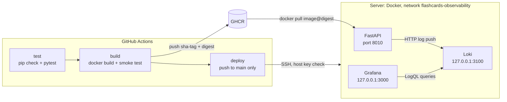

# Learning Flashcards API

[](https://github.com/eliv1982/learning-flashcards-api/actions/workflows/deploy.yml?query=branch%3Amain)

A compact engineering/DevOps demo built on **FastAPI**. The service itself is deliberately small: a static, read-only REST API with flashcards for review. The point of the repository is the engineering loop around it: strict data validation, tests, a non-root Docker image, CI/CD in GitHub Actions, publishing to GHCR, immutable deployment over SSH with `/health` verification and rollback, and log shipping to Loki and Grafana.

> **This API has no AI/ML functionality.** There is no LLM, text generation, embeddings, or calls to external AI services in the code. Some of the cards are about AI, LLM and RAG (the others cover Git, Docker and CI/CD); that is only the subject matter of the dataset.

## What this project demonstrates

- **FastAPI, Pydantic and typed OpenAPI:** typed responses, `422`/`404` handling, and a correct OpenAPI schema.
- **Strict startup validation:** the application refuses to start with an invalid set of cards.
- **pytest:** automated tests that need no network or external services.
- **Docker:** an image based on Python 3.12 pinned by digest, running as a non-root user, with runtime dependencies only.
- **GitHub Actions CI/CD:** a mandatory `test → build → deploy` gate, with a smoke test of the same image that is then published.
- **GHCR and immutable SSH deployment:** the image is pinned as `sha-<commit>@sha256:<digest>`, and the server's host key is verified against a fingerprint.
- **Health verification and rollback:** `/health` is checked after deployment, with automatic rollback to the previous release.
- **Observability:** non-blocking log shipping to Loki, viewing in Grafana, and monitoring reachable only from the server's localhost.

## Architecture



The workflow deploys the API container. Loki and Grafana are started on the server separately with `docker compose` (see [Observability](#observability)); the workflow does not touch them.

## API

| Method | Path | Response |
|--------|------|----------|
| GET | `/` | service description and a list of endpoints |
| GET | `/health` | `{"status": "ok"}` |
| GET | `/cards` | all cards |
| GET | `/cards/random` | a random card |
| GET | `/cards/{card_id}` | the card with that `id`; `404` (`{"detail": "Card not found"}`) if it does not exist; `422` if `id` is not an integer |
| GET | `/quiz` | a random card without the `answer` field: `id`, `topic`, `question`, `hint` |

Interactive documentation (Swagger UI) is at `/docs` and the schema at `/openapi.json`. Locally: [http://127.0.0.1:8000/docs](http://127.0.0.1:8000/docs); on a deployed server: `http://<server>:8010/docs`.

- **Data.** The cards live in the static file [data/flashcards.json](data/flashcards.json) and are read once at startup. All endpoints are read-only: there is no database, no writes, no users and no authorization. To change the set of cards, edit the file and restart the application (with Docker, rebuild the image).
- **Startup validation.** The file must be a non-empty JSON list. Every card needs an integer `id` and non-empty string `topic`, `question`, `answer` and `hint`; extra fields and type coercion are rejected; `id` values must be unique. Any error stops the application from starting with a clear message; a partially loaded set never occurs.
- **Typed OpenAPI.** Responses are described by the models `Card`, `QuizQuestion`, `HealthResponse`, `RootResponse` and `ErrorResponse`; the `404` of `/cards/{card_id}` is documented.
- **`/quiz` behavior.** The `QuizQuestion` response model physically has no `answer` field, and the OpenAPI schema reflects that. This demonstrates the shape of a response; it is not data protection: `/cards` and `/cards/{card_id}` return complete cards, and the API has no answer checking.

## Running locally

The project is tested on Python 3.12 (as in the Docker image and CI); other versions are not tested.

```bash
python -m venv .venv
source .venv/bin/activate        # Windows: .venv\Scripts\activate
pip install -r requirements.txt
uvicorn main:app --reload
```

Without a running Loki the application works as usual; a warning about undelivered logs is printed to stdout at most once a minute (see [Observability](#observability)).

## Tests

`requirements.txt` lists the application dependencies (all versions pinned); `requirements-dev.txt` is the same plus pytest and httpx. The CI `test` job runs the same commands:

```bash
pip install -r requirements-dev.txt
python -m pip check
python -m pytest -q
```

The tests cover: validation of the card set and application startup with invalid data; routes and response codes; the shape of `/quiz`; the OpenAPI schema; log levels and fields, the bounded queue, timeouts, the background thread lifecycle, and the fact that an unavailable or hanging Loki does not slow requests down. The tests never touch the network: any attempt at a real HTTP request fails the test.

## Docker

```bash
docker build -t learning-flashcards-api .
docker run --rm -p 8000:8000 learning-flashcards-api
```

Check: [http://127.0.0.1:8000/health](http://127.0.0.1:8000/health).

- The base image is Python 3.12 slim (Debian 13), pinned to an exact version and digest; update the tag and digest together (see the comment in the [Dockerfile](Dockerfile)).
- The process runs as an unprivileged user (UID/GID 10001, no shell); the code in the image is owned by root and is read-only for the application user.
- The image contains only `main.py`, `app/`, `data/` and the dependencies from `requirements.txt`; pytest and httpx are not included (CI verifies this).

Running with log shipping to Loki (the monitoring stack is already running and the network exists):

```bash
docker network create flashcards-observability || true
docker run --rm -p 8000:8000 \
  --network flashcards-observability \
  -e APP_NAME=learning-flashcards-api \
  -e LOKI_URL=http://loki:3100/loki/api/v1/push \
  learning-flashcards-api
```

## Observability

The application sends logs straight to **Loki** through the HTTP `POST /loki/api/v1/push` API (no Promtail); **Grafana** reads them from Loki.

**What is logged.** The middleware writes one event per HTTP request: JSON with `method`, `route` (the route template such as `/cards/{card_id}`, or `unmatched` for unknown paths), `status_code` and `duration_ms` (plus `error_type` on an unhandled exception). The actual path, query string, headers, cookies and request body are not logged. At startup a separate `{"event": "application_started"}` record is sent.

**Levels.** `5xx` is `ERROR` (including unhandled exceptions), `4xx` is `WARNING` (including `422`), everything else is `INFO`. The only Loki labels are `app`, `level` and `method`; other fields are not promoted to labels, to avoid cardinality growth. Use `| json` to parse them.

**Requests are never blocked.** The middleware only puts an event on a bounded queue (1000 events); a single background thread sends events to Loki with timeouts (connect 1 s, read 2 s). If Loki is unavailable or slow, the application neither crashes nor slows down: when the queue overflows, events are dropped, and `WARNING: Failed to send log to Loki: ...` is printed to stdout at most once a minute. Delivery is best-effort: when the application shuts down, the queue is not flushed.

| Variable | Default | Description |
|----------|---------|-------------|
| `LOKI_URL` | `http://localhost:3100/loki/api/v1/push` | URL of the Loki push API |
| `APP_NAME` | `learning-flashcards-api` | value of the `app` label |

The default `LOKI_URL` matches the port the monitoring stack publishes on the host, so locally, with the stack running, nothing needs to be set. Inside the `flashcards-observability` Docker network, Loki is reachable as `http://loki:3100`.

### Starting the monitoring stack

Loki and Grafana are defined in [monitoring/docker-compose.yml](monitoring/docker-compose.yml). First create the shared Docker network (repeating the command is safe), then set the Grafana password and start the stack:

```bash
docker network create flashcards-observability || true
cd monitoring
cp .env.example .env          # Windows: copy .env.example .env
# open .env and set GRAFANA_ADMIN_PASSWORD
docker compose up -d
docker compose ps
```

- **Grafana password.** `GRAFANA_ADMIN_PASSWORD` is required: there is no default, and `docker compose` fails if the variable is empty or unset. The real password is kept only in `monitoring/.env`, which git ignores (only the `.env.example` template is tracked); do not use `admin`. Compose reads this file for any command run from the `monitoring/` directory. The login is `admin`. The password is applied only when the Grafana volume is first initialized; to change it later:

  ```bash
  docker compose exec grafana grafana cli admin reset-admin-password '<new password>'
  ```

- **Localhost only.** Grafana (`3000`) and Loki (`3100`) are published only on the host's `127.0.0.1` and are not reachable from outside; no firewall ports need to be opened. The API container sends logs to Loki over the Docker network, so no external port is needed for that.
- **Grafana locally:** [http://localhost:3000](http://localhost:3000). **On a server**, use an SSH tunnel:

  ```bash
  ssh -L 3000:127.0.0.1:3000 <user>@<server>
  ```

  While the tunnel is open, Grafana is available at [http://localhost:3000](http://localhost:3000).
- **Datasource.** Loki is connected automatically through [monitoring/grafana/provisioning/datasources/datasources.yml](monitoring/grafana/provisioning/datasources/datasources.yml). No ready-made dashboards are included in the repository.
- **Persistence and retention.** Data lives in named Docker volumes (`loki-data`, `grafana-data`; Compose prefixes the names with the project name, usually `monitoring_`) and survives `docker compose down` and a host restart (`restart: unless-stopped`); `docker compose down -v` deletes the volumes together with their data. Loki keeps logs for **7 days** (`retention_period: 168h`, compactor with `retention_enabled: true`, in [monitoring/loki-config.yml](monitoring/loki-config.yml)). Image versions are pinned by tag (`grafana/loki:2.9.0`, `grafana/grafana:10.1.0`).

On a server the stack is set up the same way: clone the repository, run the commands above from the `monitoring/` directory, and start it **before** generating traffic to the API. To verify the chain, make a few requests on the server:

```bash
curl http://127.0.0.1:8010/health
curl http://127.0.0.1:8010/cards
curl http://127.0.0.1:8010/cards/999      # 404 -> a record with level="WARNING"
```

### LogQL queries

In Grafana: **Explore → Loki**, with a time range such as *Last 15 minutes*.

| Purpose | LogQL |
|---------|-------|
| Log table | `{app="learning-flashcards-api"} \| json` |
| Count by level (for a Pie chart) | `sum by (level) (count_over_time({app="learning-flashcards-api"}[$__range]))` |

## CI/CD and deployment

Workflow: [.github/workflows/deploy.yml](.github/workflows/deploy.yml) (named "CI and deploy"). It runs on `pull_request` and on `push` to `main`. The job chain is `test → build → deploy`; each job starts only after the previous one succeeds, and `deploy` runs only for a `push` to `main`. Token permissions are set per job on a least-privilege basis.

- **`test`** is the mandatory gate: Python 3.12, `pip install -r requirements-dev.txt`, `pip check`, `pytest -q`. While the tests are red, no image is built, published or deployed.
- **`build`** builds the image once. That same image goes through the smoke test and is then (only on a `push` to `main`) published to GHCR without a rebuild. The smoke test checks that the image has no pytest or httpx, that the container starts while Loki is unreachable, that `/health` and `/quiz` respond, and that the process does not run as root. Two tags are published to `ghcr.io/<owner>/<repo>` (for this repository, `ghcr.io/eliv1982/learning-flashcards-api`): `sha-<full commit SHA>` (immutable; deployment uses exactly this tag, additionally pinned by digest) and `latest` (for manual `docker pull` only; deployment does not use it).
- **`deploy`** takes the image from the `build` job of the same run. Deployments run strictly one at a time (`concurrency`), and one already in progress is never cancelled. Before SSH, the job checks that the run's commit is still the tip of `main`: if it is not, the deployment is skipped cleanly (the job succeeds with the message `Stale deployment skipped`, and no connection to the server is made); if the tip cannot be determined, the job fails. Because of this, re-running the deployment of an old commit is also skipped; to return to an old release, use the [manual rollback](#manual-rollback). The job also checks that the secrets exist and have the right format (values are never printed). The connection is made by [appleboy/ssh-action](https://github.com/appleboy/ssh-action), pinned to the commit SHA of release v1.2.0.

The deployment logic on the server (strict-mode Bash) lives in the workflow itself. The sequence is:

1. `docker login ghcr.io` with the job token into a temporary `DOCKER_CONFIG`, then `docker pull` of the exact image; if the image cannot be pulled, the running service is not affected;
2. the `flashcards-observability` network is created only if it does not exist yet;
3. the current container `learning-flashcards-api` is stopped and renamed to `learning-flashcards-api-previous` (at most one such container is kept);
4. the new container `learning-flashcards-api` is started from the immutable image with `--restart unless-stopped`, host port `8010`, and `LOKI_URL=http://loki:3100/loki/api/v1/push`;
5. `http://127.0.0.1:8010/health` is polled for up to 30 seconds; the deployment succeeds only after a `200 {"status":"ok"}` response.

Deployment is not seamless: the API is briefly unavailable between stopping the old container and starting the new one.

### Automatic rollback

If the new container does not start, falls into a restart loop, or fails the `/health` check, the script prints its logs, removes it, restores `-previous` under its original name, starts it and checks `/health`; the job itself still finishes with an **error**. On a first deployment, when there is no previous container, only the failed one is removed. What to restore is determined from the containers that actually exist on the server, so rollback also works after an SSH disconnect or a cancelled run.

### Manual rollback

On the server, to return to the previous release:

```bash
docker rm -f learning-flashcards-api
docker rename learning-flashcards-api-previous learning-flashcards-api
docker update --restart unless-stopped learning-flashcards-api
docker start learning-flashcards-api
curl http://127.0.0.1:8010/health
```

If `-previous` no longer exists, start the release you need from its immutable tag (run `docker login ghcr.io` first if necessary, and remove any existing container with that name):

```bash
docker run -d --name learning-flashcards-api --restart unless-stopped \
  --network flashcards-observability \
  -e APP_NAME=learning-flashcards-api \
  -e LOKI_URL=http://loki:3100/loki/api/v1/push \
  -p 8010:8000 \
  ghcr.io/<owner>/<repo>:sha-<full SHA>
```

### Secrets and the SSH host key

Repository secrets (values are not stored in git; they are configured in the repository settings on GitHub): `SSH_HOST`, `SSH_PORT`, `SSH_USERNAME`, `SSH_KEY` (the private key) and `SSH_FINGERPRINT`, the server's host key fingerprint in the `SHA256:…` format printed by `ssh-keygen -l`. Without `SSH_FINGERPRINT` the deployment does not run: the action compares the key the server presents with this value, and on a mismatch it fails with `host key fingerprint mismatch` before any script runs on the server.

`SSH_FINGERPRINT` must match the fingerprint of the host key (or host certificate) that the server **actually presents** to the client during SSH negotiation, given the effective `sshd` configuration. The mere presence of `/etc/ssh/ssh_host_*_key.pub` does not prove this: a key may be disabled in `sshd_config` (`HostKey`, `HostKeyAlgorithms`), and `HostCertificate` changes what is presented (a certificate has its own fingerprint, different from that of the key in the `.pub` file).

Obtain the fingerprint **only over a trusted channel**: through your hosting provider's console or an already trusted SSH session to the server:

1. Look at the effective configuration: `sudo sshd -T | grep -Ei '^(hostkey|hostcertificate|hostkeyalgorithms) '`.
2. Capture what the server presents on its SSH port. A plain `ssh-keyscan` requests only **regular host keys**; if the server uses `HostCertificate`, you need `ssh-keyscan -c`, otherwise certificates are not requested:

   ```bash
   # regular host key
   ssh-keyscan -p <ssh-port> 127.0.0.1 | ssh-keygen -lf -
   # host certificate (the server uses HostCertificate)
   ssh-keyscan -c -p <ssh-port> 127.0.0.1 | ssh-keygen -lf -
   ```

   Each output line is a presented key or certificate and its `SHA256:…` fingerprint. If you capture it from another machine (`ssh-keyscan <server>`), use the value only after independently verifying it over the trusted channel above.
3. If one key is presented, that is the value you need. If several are, the value must not depend on the client's choice: leave the server a single host key (`HostKey` / `HostKeyAlgorithms`, check with `sudo sshd -t`, then reload the `sshd` configuration) and take the fingerprint of that key.
4. Do not trust a fingerprint first seen over an untrusted network, and do not copy the value from someone else's output or from an error message: on its own it proves nothing. On a mismatch, repeat the steps above rather than "adjusting" the value.

## Security and operations

- Deployment publishes the API on host port `8010` over plain HTTP, with no TLS, authorization or rate limiting; the data is public and read-only. Closing the port, a reverse proxy and TLS are the server operator's responsibility.
- Loki runs without authentication (`auth_enabled: false`): protection is binding the Loki and Grafana ports to `127.0.0.1` and Docker network isolation. Any container on the `flashcards-observability` network can write to and read from Loki.
- Secrets and the Grafana password are not stored in the repository; the registry token on the server exists only for the duration of `docker pull`.
- The application image uses an unprivileged user, a base image pinned by digest, pinned dependency versions and runtime packages only.
- Logs contain no raw paths, query strings, headers or request bodies.
- The server keeps one previous release for rollback; old images are not removed automatically.

## Project scope

The project is intentionally small and does not claim production-system maturity. Out of scope: AI/ML functionality, a database and write operations, users and authorization, metrics, tracing and alerts (logs only), built-in Grafana dashboards, automatic dependency updates, orchestrators (Kubernetes and the like) and infrastructure as code. The only environment is a single server running Docker.

## License

No license has been chosen: there is no `LICENSE` file in the repository, and all rights remain with the author.
