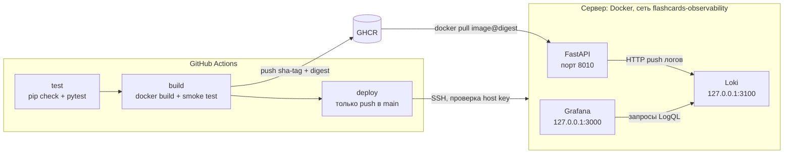

# AI Learning Flashcards API

[](https://github.com/eliv1982/ai-learning-flashcards-api/actions/workflows/deploy.yml?query=branch%3Amain)

Компактный демонстрационный проект на **FastAPI**: небольшое read-only REST API с карточками для повторения, вокруг которого выстроен полный инженерный контур — тесты, Docker-образ, CI/CD в GitHub Actions, публикация в GHCR, неизменяемый деплой по SSH с проверкой `/health` и откатом, логи в Loki и Grafana.

> **API не использует AI/ML.** В коде нет LLM, генерации текста, эмбеддингов и вызовов внешних AI-сервисов. «AI» в названии репозитория — историческое имя проекта и тематика части карточек (AI, LLM, RAG; остальные — Git, Docker, CI/CD). Проект начинался как учебный и сохранён как демонстрация инженерной практики, а не AI-продукт.

## Что демонстрирует проект

- проектирование API на FastAPI: типизированные ответы, `422`/`404`, корректная OpenAPI-схема;
- строгую валидацию данных при старте: приложение не запускается с некорректным набором карточек;
- Docker: образ на базе Python 3.12, закреплённого по digest, запуск не от root, только runtime-зависимости;
- GitHub Actions: обязательный gate `test → build → deploy`, smoke-тест того же образа, который затем публикуется;
- GHCR и неизменяемый деплой по SSH: образ закрепляется по `sha-<коммит>@sha256:<digest>`, host key сервера проверяется по отпечатку;
- проверку `/health` после деплоя и автоматический откат на предыдущий релиз;
- наблюдаемость: неблокирующая отправка логов в Loki, просмотр в Grafana, доступ к мониторингу только с localhost сервера;
- автотесты, не требующие сети и внешних сервисов.

## Архитектура



API-контейнер разворачивает workflow. Loki и Grafana запускаются на сервере отдельно, через `docker compose` (см. [Наблюдаемость](#наблюдаемость)); workflow их не трогает.

## API

| Метод | Путь | Ответ |
|-------|------|-------|
| GET | `/` | описание сервиса и список эндпоинтов |
| GET | `/health` | `{"status": "ok"}` |
| GET | `/cards` | все карточки |
| GET | `/cards/random` | случайная карточка |
| GET | `/cards/{card_id}` | карточка по `id`; `404` (`{"detail": "Card not found"}`), если её нет; `422`, если `id` не целое число |
| GET | `/quiz` | случайная карточка без поля `answer`: `id`, `topic`, `question`, `hint` |

Интерактивная документация (Swagger UI): `/docs`, схема — `/openapi.json`. Локально — [http://127.0.0.1:8000/docs](http://127.0.0.1:8000/docs), на развёрнутом сервере — `http://<server>:8010/docs`.

- **Данные.** Карточки лежат в статическом файле [data/flashcards.json](data/flashcards.json) и читаются один раз при старте. Все эндпоинты — только чтение: нет БД, записи, пользователей и авторизации. Чтобы изменить набор карточек, правьте файл и перезапускайте приложение (в Docker — пересобирайте образ).
- **Валидация при старте.** Файл должен быть непустым JSON-списком; у каждой карточки — целочисленный `id` и непустые строки `topic`, `question`, `answer`, `hint`; лишние поля и приведение типов запрещены; `id` уникальны. Любая ошибка останавливает запуск приложения с понятным сообщением, частично загруженного набора не бывает.
- **Типизированный OpenAPI.** Ответы описаны моделями `Card`, `QuizQuestion`, `HealthResponse`, `RootResponse`, `ErrorResponse`; `404` у `/cards/{card_id}` задокументирован.
- **Поведение `/quiz`.** Модель ответа `QuizQuestion` физически не содержит `answer`, схема OpenAPI это отражает. Это демонстрация формы ответа, а не защита данных: `/cards` и `/cards/{card_id}` отдают карточки целиком, а проверки ответов в API нет.

## Локальный запуск

Проект проверяется на Python 3.12 (как в Docker-образе и CI); другие версии не тестируются.

```bash
python -m venv .venv
source .venv/bin/activate        # Windows: .venv\Scripts\activate
pip install -r requirements.txt
uvicorn main:app --reload
```

Без запущенного Loki приложение работает как обычно; в stdout не чаще раза в минуту появляется предупреждение о недоставленных логах (подробнее — в разделе [Наблюдаемость](#наблюдаемость)).

## Тесты

`requirements.txt` — зависимости приложения (все версии закреплены), `requirements-dev.txt` — то же плюс pytest и httpx. Те же команды выполняет job `test` в CI:

```bash
pip install -r requirements-dev.txt
python -m pip check
python -m pytest -q
```

Тесты покрывают: валидацию набора карточек и запуск приложения с некорректными данными; маршруты и коды ответов; форму `/quiz`; схему OpenAPI; уровни и поля логов, ограниченную очередь, таймауты, жизненный цикл фонового потока и то, что недоступный или «зависший» Loki не замедляет запросы. Тесты не обращаются к сети: любая попытка реального HTTP-запроса роняет тест.

## Docker

```bash
docker build -t ai-learning-flashcards-api .
docker run --rm -p 8000:8000 ai-learning-flashcards-api
```

Проверка: [http://127.0.0.1:8000/health](http://127.0.0.1:8000/health).

- Базовый образ — Python 3.12 slim (Debian 13), закреплён по точной версии и digest; обновлять тег и digest нужно вместе (см. комментарий в [Dockerfile](Dockerfile)).
- Процесс работает от непривилегированного пользователя (UID/GID 10001, без shell); код в образе принадлежит root и доступен пользователю приложения только на чтение.
- В образ попадают только `main.py`, `app/`, `data/` и зависимости из `requirements.txt`; pytest и httpx в него не входят (CI это проверяет).

Запуск с отправкой логов в Loki (monitoring stack уже запущен, сеть создана):

```bash
docker network create flashcards-observability || true
docker run --rm -p 8000:8000 \
  --network flashcards-observability \
  -e APP_NAME=ai-learning-flashcards-api \
  -e LOKI_URL=http://loki:3100/loki/api/v1/push \
  ai-learning-flashcards-api
```

## Наблюдаемость

Приложение отправляет логи напрямую в **Loki** через HTTP `POST /loki/api/v1/push` (без Promtail); **Grafana** читает их из Loki.

**Что логируется.** Middleware пишет по одному событию на каждый HTTP-запрос: JSON с `method`, `route` (шаблон маршрута вроде `/cards/{card_id}`, для неизвестных путей — `unmatched`), `status_code`, `duration_ms` (при необработанном исключении добавляется `error_type`). Реальный путь, query-строка, заголовки, cookie и тело запроса не логируются. При старте отправляется отдельная запись `{"event": "application_started"}`.

**Уровни.** `5xx` — `ERROR` (включая необработанные исключения), `4xx` — `WARNING` (включая `422`), остальные — `INFO`. Labels в Loki только `app`, `level`, `method`; остальные поля в labels не выносятся, чтобы не раздувать кардинальность — для разбора используйте `| json`.

**Не блокирует запросы.** Middleware только кладёт событие в ограниченную очередь (1000 событий); один фоновый поток отправляет их в Loki с таймаутом (connect 1 с, read 2 с). Если Loki недоступен или медленный, приложение не падает и не замедляется: при переполнении очереди события отбрасываются, а в stdout не чаще раза в минуту выводится `WARNING: Failed to send log to Loki: ...`. Доставка — best-effort: при остановке приложения очередь не досылается.

| Переменная | По умолчанию | Описание |
|------------|--------------|----------|
| `LOKI_URL` | `http://localhost:3100/loki/api/v1/push` | URL push API Loki |
| `APP_NAME` | `ai-learning-flashcards-api` | значение label `app` |

Значение `LOKI_URL` по умолчанию совпадает с портом, который monitoring stack публикует на хосте, поэтому локально при запущенном стеке ничего задавать не нужно. Внутри Docker-сети `flashcards-observability` Loki доступен как `http://loki:3100`.

### Запуск monitoring stack

Loki и Grafana описаны в [monitoring/docker-compose.yml](monitoring/docker-compose.yml). Сначала создайте общую Docker-сеть (повторная команда безопасна), затем задайте пароль Grafana и запустите стек:

```bash
docker network create flashcards-observability || true
cd monitoring
cp .env.example .env          # Windows: copy .env.example .env
# откройте .env и задайте GRAFANA_ADMIN_PASSWORD
docker compose up -d
docker compose ps
```

- **Пароль Grafana.** `GRAFANA_ADMIN_PASSWORD` обязателен: значения по умолчанию нет, при пустой или незаданной переменной `docker compose` завершается с ошибкой. Реальный пароль хранится только в `monitoring/.env`, который игнорируется git (tracked остаётся лишь шаблон `.env.example`); не используйте `admin`. Compose читает этот файл при любой команде из каталога `monitoring/`. Логин — `admin`. Пароль применяется только при первой инициализации тома Grafana; сменить его позже можно так:

  ```bash
  docker compose exec grafana grafana cli admin reset-admin-password '<новый пароль>'
  ```

- **Доступ только с localhost.** Grafana (`3000`) и Loki (`3100`) опубликованы только на `127.0.0.1` хоста и снаружи недоступны; порты в firewall открывать не нужно. API-контейнер отправляет логи в Loki по Docker-сети, внешний порт для этого не требуется.
- **Grafana локально:** [http://localhost:3000](http://localhost:3000). **На сервере** — через SSH-туннель:

  ```bash
  ssh -L 3000:127.0.0.1:3000 <user>@<server>
  ```

  Пока туннель открыт, Grafana доступна на [http://localhost:3000](http://localhost:3000).
- **Datasource.** Loki подключается автоматически через [monitoring/grafana/provisioning/datasources/datasources.yml](monitoring/grafana/provisioning/datasources/datasources.yml). Готовые дашборды в репозитории не поставляются.
- **Хранение и retention.** Данные лежат в именованных Docker-томах (`loki-data`, `grafana-data`; Compose добавляет к именам префикс проекта, обычно `monitoring_`) и переживают `docker compose down` и перезапуск хоста (`restart: unless-stopped`); `docker compose down -v` удаляет тома вместе с данными. Loki хранит логи **7 дней** (`retention_period: 168h`, компактор с `retention_enabled: true` в [monitoring/loki-config.yml](monitoring/loki-config.yml)). Версии образов закреплены тегами (`grafana/loki:2.9.0`, `grafana/grafana:10.1.0`).

На сервере стек разворачивается так же: клонируйте репозиторий, выполните команды выше из каталога `monitoring/` и запустите его **до** генерации трафика к API. Чтобы проверить цепочку, сделайте несколько запросов на сервере:

```bash
curl http://127.0.0.1:8010/health
curl http://127.0.0.1:8010/cards
curl http://127.0.0.1:8010/cards/999      # 404 -> запись с level="WARNING"
```

### Запросы LogQL

В Grafana: **Explore → Loki**, диапазон, например, *Last 15 minutes*.

| Вид | LogQL |
|-----|-------|
| Таблица логов | `{app="ai-learning-flashcards-api"} \| json` |
| Количество по уровню (для Pie chart) | `sum by (level) (count_over_time({app="ai-learning-flashcards-api"}[$__range]))` |

## CI/CD и деплой

Workflow: [.github/workflows/deploy.yml](.github/workflows/deploy.yml) (имя — «CI and deploy»). Запускается на `pull_request` и на `push` в `main`. Цепочка jobs — `test → build → deploy`; каждый следующий job стартует только после успешного предыдущего, а `deploy` выполняется только для `push` в `main`. Права токена заданы на уровне job по принципу минимально необходимых.

- **`test`** — обязательный gate: Python 3.12, `pip install -r requirements-dev.txt`, `pip check`, `pytest -q`. Пока тесты красные, образ не собирается, не публикуется и не деплоится.
- **`build`** — образ собирается один раз. Именно он проходит smoke-тест и затем (только при `push` в `main`) публикуется в GHCR без пересборки. Smoke-тест проверяет: в образе нет pytest и httpx; контейнер стартует при недоступном Loki; `/health` и `/quiz` отвечают; процесс работает не от root. Публикуются два тега `ghcr.io/<owner>/<repo>`: `sha-<полный SHA коммита>` (неизменяемый — деплой берёт именно его, дополнительно закреплённый по digest) и `latest` (только для ручного `docker pull`, деплой его не использует).
- **`deploy`** — берёт образ из `build` того же запуска. Деплои идут строго по одному (`concurrency`), уже идущий не отменяется. Перед SSH проверяется, что коммит запуска всё ещё на вершине `main`: если нет, деплой штатно пропускается (job успешен, сообщение `Stale deployment skipped`, к серверу подключения не было); если вершину определить не удалось, job падает. Из-за этого повторный запуск деплоя старого коммита тоже пропускается — к старому релизу возвращайтесь [ручным откатом](#ручной-откат). Также проверяется наличие и формат секретов (значения не печатаются). Подключение выполняет [appleboy/ssh-action](https://github.com/appleboy/ssh-action), закреплённый на commit SHA релиза v1.2.0.

Логика деплоя на сервере (Bash со строгим режимом) — в самом workflow. Последовательность:

1. `docker login ghcr.io` токеном job во временном `DOCKER_CONFIG` и `docker pull` точного образа; если образ не скачался, работающий сервис не затрагивается;
2. сеть `flashcards-observability` создаётся, только если её ещё нет;
3. текущий контейнер `ai-learning-flashcards-api` останавливается и переименовывается в `ai-learning-flashcards-api-previous` (хранится не больше одного такого контейнера);
4. запускается новый контейнер `ai-learning-flashcards-api` из неизменяемого образа: `--restart unless-stopped`, порт хоста `8010`, `LOKI_URL=http://loki:3100/loki/api/v1/push`;
5. до 30 секунд опрашивается `http://127.0.0.1:8010/health`; деплой успешен только после ответа `200 {"status":"ok"}`.

Деплой не бесшовный: между остановкой старого и стартом нового контейнера API кратко недоступен.

### Автоматический откат

Если новый контейнер не стартует, уходит в цикл перезапусков или не проходит проверку `/health`, скрипт показывает его логи, удаляет его, возвращает `-previous` под прежним именем, запускает и проверяет `/health`; сам job при этом завершается **ошибкой**. При первом деплое, когда предыдущего контейнера нет, удаляется только неудавшийся. Что восстанавливать, определяется по контейнерам, реально существующим на сервере, поэтому откат срабатывает и при обрыве SSH или отмене запуска.

### Ручной откат

На сервере, чтобы вернуться к предыдущему релизу:

```bash
docker rm -f ai-learning-flashcards-api
docker rename ai-learning-flashcards-api-previous ai-learning-flashcards-api
docker update --restart unless-stopped ai-learning-flashcards-api
docker start ai-learning-flashcards-api
curl http://127.0.0.1:8010/health
```

Если `-previous` уже нет, запустите нужный релиз по неизменяемому тегу (при необходимости сначала `docker login ghcr.io`; предыдущий контейнер с этим именем удалите):

```bash
docker run -d --name ai-learning-flashcards-api --restart unless-stopped \
  --network flashcards-observability \
  -e APP_NAME=ai-learning-flashcards-api \
  -e LOKI_URL=http://loki:3100/loki/api/v1/push \
  -p 8010:8000 \
  ghcr.io/<owner>/<repo>:sha-<полный SHA>
```

### Секреты и SSH host key

Секреты репозитория (значения в git не хранятся, настраиваются в настройках репозитория на GitHub): `SSH_HOST`, `SSH_PORT`, `SSH_USERNAME`, `SSH_KEY` (приватный ключ) и `SSH_FINGERPRINT` — отпечаток host key сервера в формате `SHA256:…`, как выводит `ssh-keygen -l`. Без `SSH_FINGERPRINT` деплой не выполняется: action сверяет предъявленный сервером ключ с этим значением, а при несовпадении завершается с `host key fingerprint mismatch` ещё до запуска скрипта на сервере.

`SSH_FINGERPRINT` должен совпадать с отпечатком того host key (или host-сертификата), который сервер **реально предъявляет** клиенту при согласовании SSH-соединения, с учётом эффективной конфигурации `sshd`. Само наличие `/etc/ssh/ssh_host_*_key.pub` этого не доказывает: ключ может быть отключён в `sshd_config` (`HostKey`, `HostKeyAlgorithms`), а `HostCertificate` меняет то, что предъявляется (у сертификата свой отпечаток, отличный от отпечатка ключа из `.pub`-файла).

Получайте отпечаток **только по доверенному каналу** — через консоль хостинг-провайдера или уже доверенную SSH-сессию на сервер:

1. Посмотрите эффективную конфигурацию: `sudo sshd -T | grep -Ei '^(hostkey|hostcertificate|hostkeyalgorithms) '`.
2. Снимите то, что сервер предъявляет на своём SSH-порту. Обычный `ssh-keyscan` запрашивает только **обычные host key**; если сервер использует `HostCertificate`, нужен `ssh-keyscan -c`, иначе сертификаты запрошены не будут:

   ```bash
   # обычный host key
   ssh-keyscan -p <ssh-port> 127.0.0.1 | ssh-keygen -lf -
   # host-сертификат (сервер использует HostCertificate)
   ssh-keyscan -c -p <ssh-port> 127.0.0.1 | ssh-keygen -lf -
   ```

   Каждая строка вывода — предъявляемый ключ или сертификат и его отпечаток `SHA256:…`. Если вы снимаете его с другой машины (`ssh-keyscan <server>`), используйте значение только после независимой сверки по доверенному каналу выше.
3. Если предъявляется один ключ, это и есть нужное значение. Если несколько, значение не должно зависеть от выбора клиента: оставьте серверу один host key (`HostKey` / `HostKeyAlgorithms`, проверка `sudo sshd -t`, затем перечитайте конфигурацию `sshd`) и возьмите отпечаток именно его.
4. Не доверяйте отпечатку, впервые увиденному по недоверенной сети, и не копируйте значение из чужого вывода или сообщения об ошибке: само по себе оно ничего не доказывает. При несовпадении повторите шаги выше, а не «подгоняйте» значение.

## Безопасность и эксплуатация

- API публикуется деплоем на порту `8010` хоста по обычному HTTP, без TLS, авторизации и rate limiting; данные публичные и read-only. Закрытие порта, reverse proxy и TLS — забота оператора сервера.
- Loki работает без аутентификации (`auth_enabled: false`): защита — привязка портов Loki и Grafana к `127.0.0.1` и изоляция Docker-сети. Любой контейнер в сети `flashcards-observability` может писать в Loki и читать из него.
- Секреты и пароль Grafana в репозитории не хранятся; токен реестра на сервере живёт только на время `docker pull`.
- Образ приложения: непривилегированный пользователь, закреплённый по digest базовый образ, закреплённые версии зависимостей, только runtime-пакеты.
- Логи не содержат сырых путей, query-строк, заголовков и тел запросов.
- На сервере хранится один предыдущий релиз для отката; старые образы автоматически не удаляются.

## Границы проекта

Проект намеренно небольшой и не претендует на зрелость production-системы. Вне его рамок: AI/ML-функциональность, база данных и операции записи, пользователи и авторизация, метрики, трейсинг и алерты (только логи), встроенные дашборды Grafana, автоматическое обновление зависимостей, оркестраторы (Kubernetes и т. п.) и инфраструктура как код. Единственная среда — один сервер с Docker.

## Лицензия

Лицензия не выбрана: файла `LICENSE` в репозитории нет, все права сохраняются за автором.
